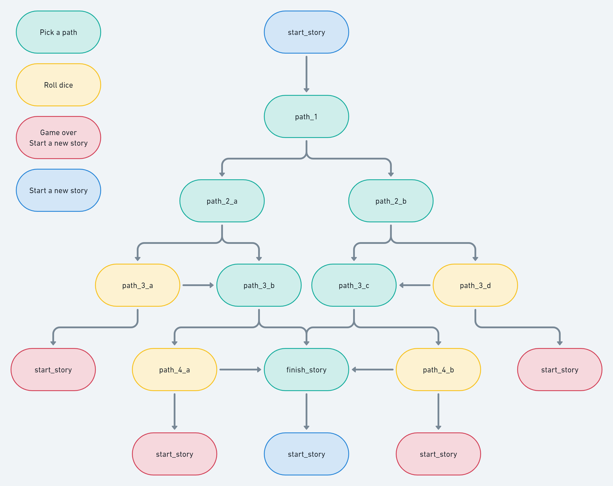
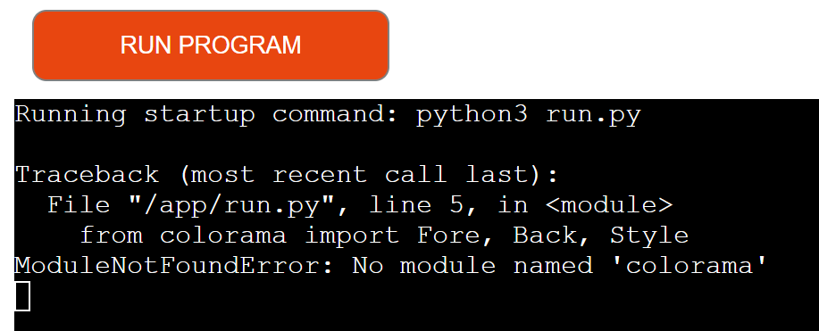

# Choose your own path story

#### The 'Choose your own path story' is a Python terminal game that tells a story and lets the user choose how the story progresses by typing in a command when promted. The user creates a character by choosing a name and that name is added to the story. In some situations, the user will get a chance to roll a dice to determine the outcome.

 

 

# Flowchart

# How to play

### The user first creates a character name, then the story begins. At every section of the story, the user chooses one of two choices in order to progress. To do this, the user types in one of the two promted commands and then press `ENTER`. Depending on the users choice, the user may have an opportunity to roll a dice to determine the outcome. Rolling a dice works the same way as choosing any other choice, except a random number between 1 and 6 is generated. The number that is generated determines what path will be chosen next. This could lead to the story ending, or if the character survives, progress to the next section of the story.

 

# Features
## Existing Features

* User enters a character name that is added into the story

 

 

* Choose from one of two paths to continue the story
  * If the user types in a wrong input, an invalid input message appears and the user must re-enter an input

 

 

 

 

* Some paths require a dice roll to determine the outcome

 

 

 

* Multiple story endings
  * So far there is only one good ending and multiple failed endings. Future features will have more endings

## Future Features

* More creative story line and paths
* Add character stats such as health, mana and stamina
* Add character classes such as warrior, mage and rogue
* Some paths will be accessible by certain classes but not the others
* Certain classes will be able to bypass a path while the others will need to roll dice
* Add items that can be picked up

# Data Model

### The project started with just a simple if/else and evolved into a multi tiered story.

 

### Each path is defined with an if/elif/else statement which directs to another defined path depending on the choice.

 

### I added f-strings so that a character name of the users choice is added to the story.

 

### Finally, I added a random module to randomly pick a number, which represents a dice roll.

 

# Testing

### I have manually tested this project by doing the following:

* Passed the code through a PEP8 linter and confirmed there are no probems
* Given invalid inputs: when inputs are out of bounds
* Tested in my local terminal and the Code Institute Heroku terminal

## Bugs

* Unable to display color in Heroku app. Works fine in Gitpod terminal however. Had to remove colorama from code in order for the deployed app to work. Will add color in future features.

 

 

## Validator Testing

* PEP8 
  * No errors were returned from PEP8online.com

## Deployment

#### This project was deployed using Code Institute's mock terminal for Heroku
* Steps for deployment:
  * Create a Heroku app
  * Set the buildbacks to Python and NodeJS in that order
  * Link the Heroku app to the repository
  * Click on deploy

## Credits
* Simen Daehlin (mentor) for help and advice
* Code Institute for the deployment terminal